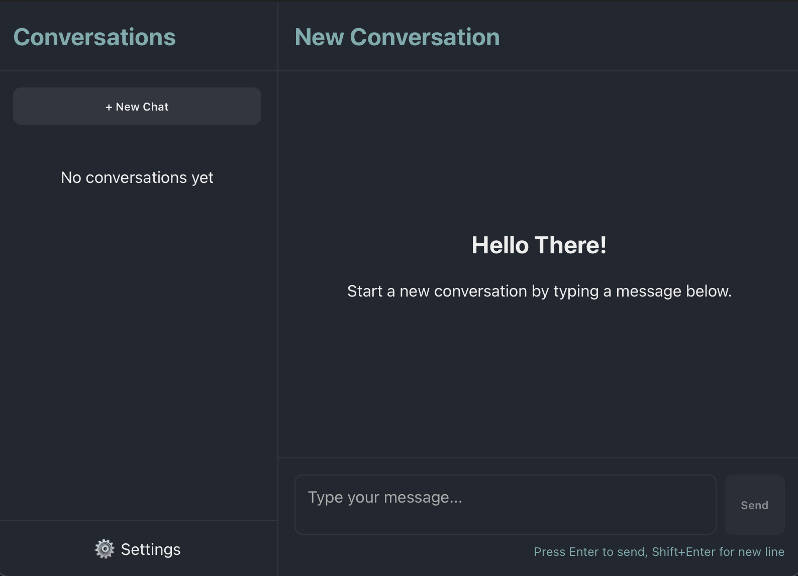
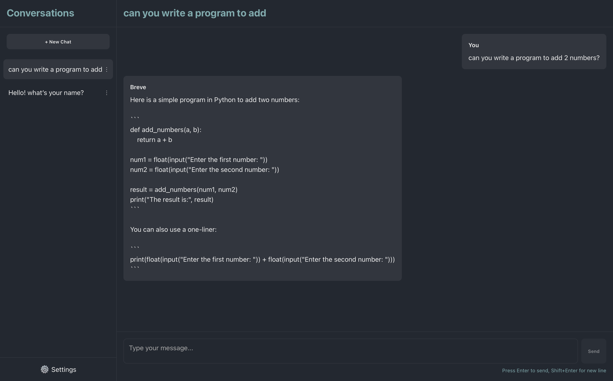
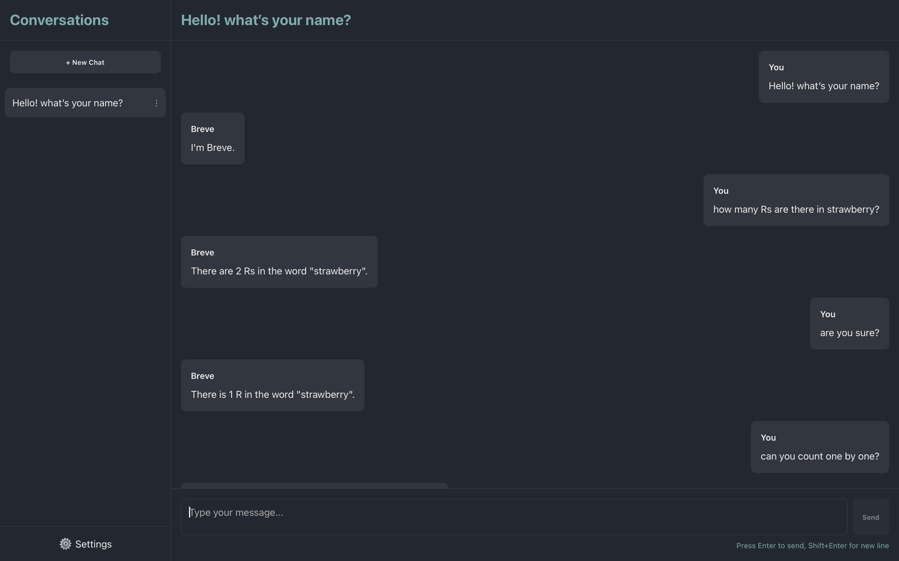

# Breve

Breve is a cross-platform application built using [Tauri](https://tauri.app/), [Vue 3](https://vuejs.org/), and [TypeScript](https://www.typescriptlang.org/). It provides a conversational interface that allows users to create, manage, and continue conversations, storing all data locally using SQLite through a Rust backend.

## Features

- Run LLMs locally on any device, without internet connection
- Calculate maximum context length and query length based on Device memory
- Cross-platform application using Tauri and Vue 3
- Create, update, and delete conversations
- Persist conversations locally in SQLite
- Rust backend for secure, high-performance operations
- Hot-reloading and easy development experience

## Screenshots




## Architecture

- **Frontend:** Vue 3, TypeScript, Vite
- **Backend:** Tauri (Rust), SQLite for local data storage
- **Data Model:** Conversations are stored and managed using a local SQLite database, with Rust providing data access and business logic.
- **Communication:** Frontend and backend interact via Tauri commands.

## Getting Started

### Prerequisites

- [Node.js](https://nodejs.org/) (16+)
- [Rust](https://www.rust-lang.org/tools/install) (stable)
- [Tauri CLI](https://tauri.app/v1/guides/getting-started/prerequisites/#installing-tauri-cli)
- [Yarn](https://yarnpkg.com/) or [npm](https://www.npmjs.com/)

### Installation

1. Clone the repository:
   ```sh
   git clone https://github.com/divy-sh/breve.git
   cd breve
   ```

2. Install frontend dependencies:
   ```sh
   yarn install
   # or
   npm install
   ```

3. If you want a specific model, change the name and url of the model in the file:
   ```sh
   config_handler.rs
   ```

4. The model will be downloaded on the first run to the appLocalData directory of yor respective system.

5. Run the development server:
   ```sh
   yarn tauri dev
   # or
   npm run tauri dev
   ```

### Build

To build the app for production:
```sh
yarn tauri build
# or
npm run tauri build
```

### Packaging

#### Setup
- Intall android sdk, and export its path - export ANDROID_HOME "android/"
- Intall android ndk, and export its path - export NDK_HOME "android/ndk/ndk-version"
- Run npm run tauri android init

To package for android:

Add the following to src-tauri/gen/android/app/build.gradle.kts: 
```kts
defaultConfig {
   ...
}

signingConfigs {
   create("release") {
      val keystorePropertiesFile = rootProject.file("keystore.properties")
      val keystoreProperties = Properties()
      if (keystorePropertiesFile.exists()) {
            keystoreProperties.load(FileInputStream(keystorePropertiesFile))
      }

      keyAlias = keystoreProperties["keyAlias"] as String
      keyPassword = keystoreProperties["password"] as String
      storeFile = file(keystoreProperties["storeFile"] as String)
      storePassword = keystoreProperties["password"] as String
   }
}
buildTypes {
   ...
}
```

Add the following to src-tauri/gen/android/app/src/main/AndroidManifest.xml
```xml
<activity
   # this line
   android:windowSoftInputMode="adjustResize"
   ...>
      <intent-filter>
      ...
      </intent-filter>
</activity>
```

Add File keystorre.properties to src-tauri/gen/android/

```properties
password=you key alias password
keyAlias=your key alias
storeFile=your google play keystore file path
```

apk file
```sh
npm run tauri android build -- --apk
```

aab file
```sh
npm run tauri android build -- --aab
```
```sh
--relese // add this for release
```

If you want to set build type debug:
```sh
--debug // add this for debug
```

To sign the android package, go through the following link:
[Tauri android App Signing](https://v2.tauri.app/distribute/sign/android/)

## Recommended IDE Setup

- [VS Code](https://code.visualstudio.com/) + [Volar](https://marketplace.visualstudio.com/items?itemName=Vue.volar) + [Tauri VSCode Extension](https://marketplace.visualstudio.com/items?itemName=tauri-apps.tauri-vscode) + [rust-analyzer](https://marketplace.visualstudio.com/items?itemName=rust-lang.rust-analyzer)

## Type Support For `.vue` Imports in TS

Since TypeScript cannot handle type information for `.vue` imports, they are shimmed to be a generic Vue component type by default. In most cases this is fine if you don't really care about component prop types outside of templates. However, if you wish to get actual prop types in `.vue` imports (for example to get props validation when using manual `h(...)` calls), you can enable Volar's Take Over mode by following these steps:

1. Run `Extensions: Show Built-in Extensions` from VS Code's command palette, look for `TypeScript and JavaScript Language Features`, then right click and select `Disable (Workspace)`. By default, Take Over mode will enable itself if the default TypeScript extension is disabled.
2. Reload the VS Code window by running `Developer: Reload Window` from the command palette.

Learn more about Take Over mode [here](https://github.com/johnsoncodehk/volar/discussions/471).

## Contributing

Contributions are welcome! Please open issues and pull requests to help improve Breve.